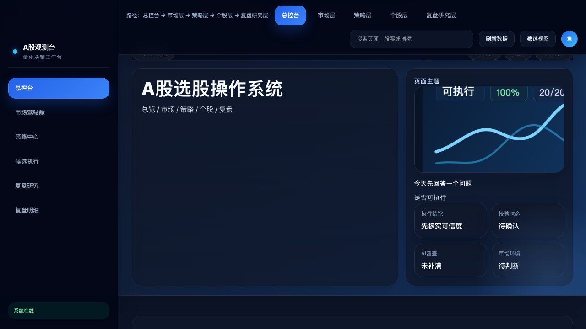
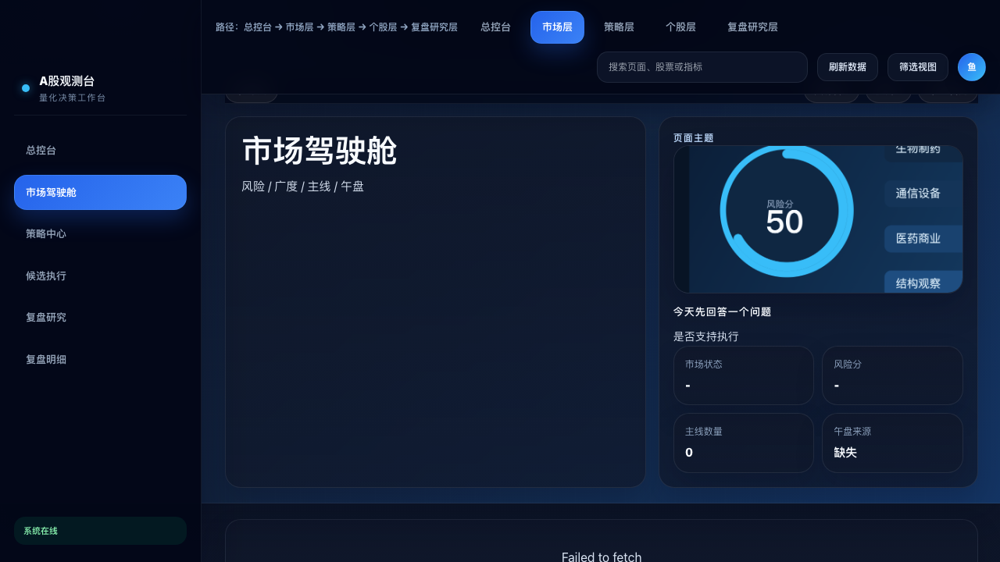
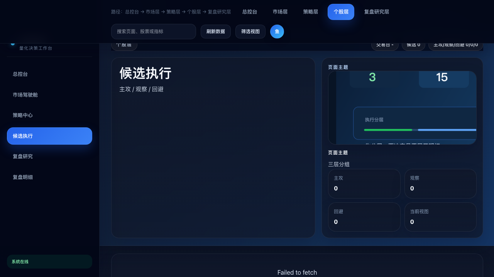
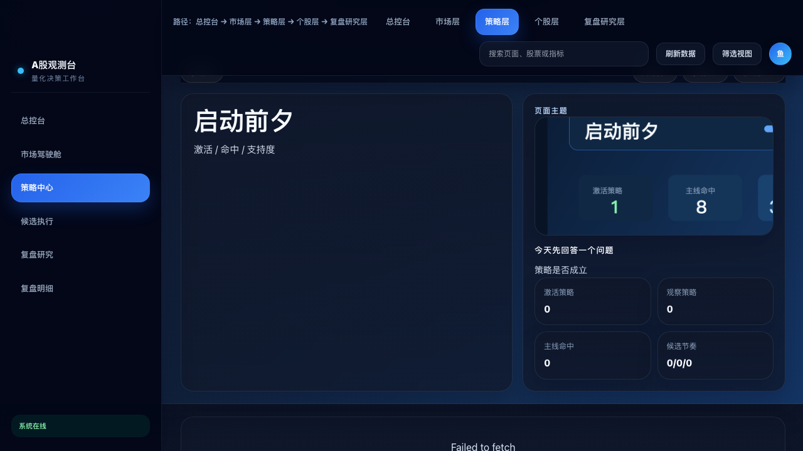

# FisherQuant · stock-report

**An autonomous AI agent system for A-share quantitative research — from daily market judgment to candidate scoring, strategy tracking, and retrospective optimization, all in one self-updating public dashboard.**

[](https://github.com/fisher-admin/stock-report/actions/workflows/deploy.yml)
[](https://github.com/fisher-admin/stock-report/commits/main)
[](https://github.com/fisher-admin/stock-report/stargazers)
[](https://github.com/fisher-admin/stock-report/forks)
[](LICENSE)
[](#architecture)

> 这不是一份静态选股报告，而是一套每日自动运行的 AI 量化研究操作系统。  
> This is not a static stock report — it is a daily self-running AI quantitative research operating system.

**Live demo:** [fisher-admin.github.io/stock-report](https://fisher-admin.github.io/stock-report/)

---

## What It Does

Most quant dashboards answer *one* question. FisherQuant answers *five*, in sequence, every single trading day:

```
① Can we trade today?      →  Market regime classification + risk scoring
② Which strategy to run?   →  Multi-strategy activation & consensus scoring
③ Which stocks to watch?   →  AI-scored candidate cards with entry/exit conditions
④ Did we get it right?     →  Automated retrospective vs. actual price movement
⑤ How to improve?          →  Factor evolution tracking + strategy parameter tuning
```

All five layers are publicly visible, fully traceable to `run_id / trade_date / generated_at`, and rebuilt automatically on each trading day.

---

## Public Status

FisherQuant is an early-stage public OSS project. The repository is maintained openly with GitHub Issues, contribution guidelines, security reporting, versioned data artifacts, and a GitHub Pages deployment. It is not distributed as a package, so monthly download metrics do not apply.

The private research backend is not included in this repository. The public scope is the static dashboard, data contract, sample outputs, verification assets, and deployment tooling.

Published market artifacts are keyed by `trade_date`. On weekends, holidays, or upstream data-delay windows, the dashboard may be generated later than the market data date; this is expected and is made explicit in each run manifest.

---

## Live Dashboard

Live site: [https://fisher-admin.github.io/stock-report/](https://fisher-admin.github.io/stock-report/)

| Layer | Page | Description |
|---|---|---|
| 🏠 System Console | `index.html` | Run status, system verdict, overall health |
| 📊 Market | `market-overview.html` | Morning brief, midday analysis, industry heatmap |
| 🎯 Strategy | `strategy-vs-market.html` | Active / watch / degraded strategy states |
| 📋 Candidates | `decision-candidates.html` | Per-stock AI decision cards |
| 🔬 Research Lab | `research-lab.html` | Alpha191 factor research, T1 model analysis |
| 🔁 Review | `recommendation-review.html` | Post-hoc validation against real market data |

### Screenshots

| System Console | Market Overview |
|---|---|
|  |  |

| Candidate Decisions | Strategy vs Market |
|---|---|
|  |  |

---

## Architecture

```
┌─────────────────────────────────────────────────────────┐
│                 FisherQuant Agent Pipeline               │
│                                                         │
│  Market Data ──▶ Market Agent ──▶ market_state.json     │
│                       │                                 │
│                       ▼                                 │
│             Strategy Orchestrator ──▶ strategy_state    │
│              (PreBreakout v4.1 / T1 / O2C)              │
│                       │                                 │
│                       ▼                                 │
│          AI Factor Research (Alpha191)                  │
│                       │                                 │
│                       ▼                                 │
│         Candidate Scoring ──▶ candidate_state.json      │
│                       │                                 │
│                       ▼                                 │
│       system_verdict.json  ◀──  Review & Validation     │
│                       │                                 │
│                       ▼                                 │
│        data/latest/*.json  ──▶  GitHub Pages            │
└─────────────────────────────────────────────────────────┘
```

The entire pipeline is orchestrated by a Python agent backend and published to this repository via **GitHub Actions** every trading day. The public site reads exclusively from `data/latest/*.json` — a strict versioned data contract ensuring every displayed result is reproducible and auditable.

---

## Data Contract

All public pages consume a single source of truth: `data/latest/`.

| File | Purpose |
|---|---|
| `run_manifest.json` | Run identity: `run_id`, `trade_date`, validation gates |
| `market_state.json` | Market regime, risk score, morning & midday context |
| `strategy_state.json` | Strategy activation states and consensus scores |
| `candidate_state.json` | Per-stock decision cards with AI reasoning |
| `review_state.json` | Retrospective summary vs. actual outcomes |
| `research_state.json` | Factor research and alpha signal analysis |
| `system_verdict.json` | Final system-level go/no-go verdict with gate checks |

Every artifact is tagged with `trade_date`, `run_id`, and `generated_at` — enabling full audit trails across runs.

---

## Key Design Decisions

- **Single data contract**: pages never parse raw analytics directly; all display logic reads from `data/latest/` only
- **Layered responsibility**: market / strategy / candidate / review are strictly separated — no layer skips upstream validation
- **Hard gates**: `system_verdict.json` enforces freshness, date consistency, and pipeline completion before anything is published
- **Zero client-side secrets**: the public site is fully static; all AI inference and data processing happens in the private agent backend

---

## Tech Stack

| Layer | Technology |
|---|---|
| Agent Backend | Python (multi-model: T1, O2C, Alpha191 pipeline) |
| Frontend | Vanilla JS + Chart.js, semantic HTML5 |
| Styling | Custom CSS design system (`assets/styles/`) |
| Deployment | GitHub Actions → GitHub Pages |
| Data Format | JSON (versioned contracts) + CSV (factor outputs) |

---

## Roadmap

### ✅ Stable

- Multi-layer pipeline: market → strategy → candidate → review
- Unified `data/latest/*.json` data contract with full traceability
- Daily auto-deploy via GitHub Actions
- AI-generated market context, Alpha191 factor research, multi-strategy scoring
- System verdict with hard gate validation

### 🚀 Codex-Driven Evolution

- [ ] **Phase 1 — Architecture Migration** ([#1](https://github.com/fisher-admin/stock-report/issues/1))  
  Transition agent memory structures and multi-model routing into a native OpenAI Codex ecosystem for deeper contextual reasoning across runs.

- [ ] **Phase 2 — Automated Maintenance** ([#2](https://github.com/fisher-admin/stock-report/issues/2))  
  Integrate Codex into GitHub Actions for autonomous PR review, incremental refactoring, and AI-driven issue triage.

- [ ] **Phase 3 — Developer Ecosystem** ([#3](https://github.com/fisher-admin/stock-report/issues/3))  
  Self-generating API documentation and contributor tooling powered by Codex code comprehension.

---

## Contributing

See [CONTRIBUTING.md](CONTRIBUTING.md) for guidelines. See [CHANGELOG.md](CHANGELOG.md) for version history. Contributions welcome in:

- **Frontend**: improving the dashboard UI/UX (`*.html`, `assets/`)
- **Data schema**: proposing extensions to the `data/latest/` contract
- **Tooling**: `generate_github_pages.py`, `deploy.sh` improvements

Please open an issue before submitting a PR for non-trivial changes.

---

## Security

See [SECURITY.md](SECURITY.md) for the vulnerability reporting policy.

---

## Disclaimer

This repository is for quantitative research, automation, and software demonstration purposes only. It is not investment advice, trading advice, or a recommendation to buy or sell any security.

---

## License

MIT — see [LICENSE](LICENSE). The license applies to the contents of this public repository. Private systems that are not included in this repository are outside its scope.
